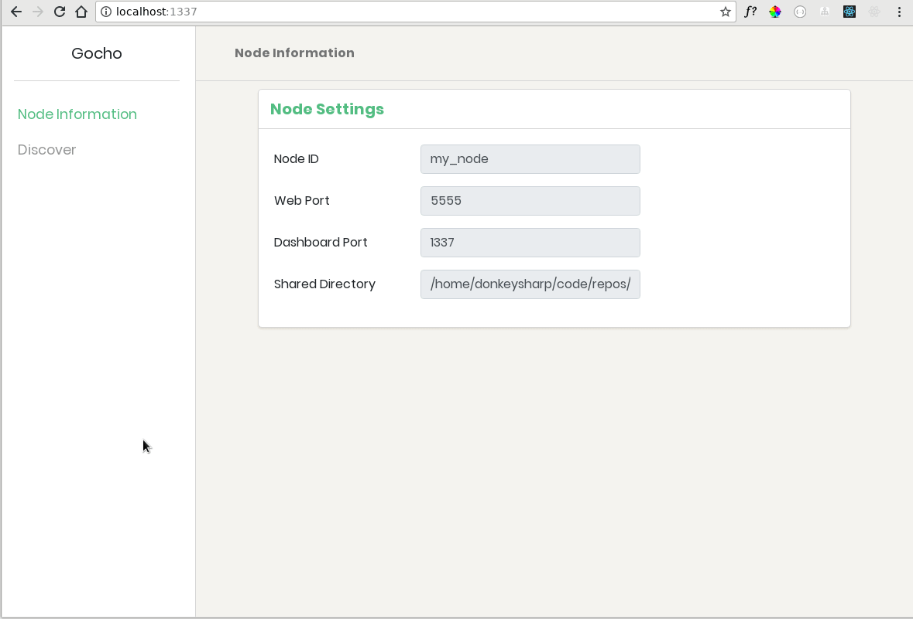
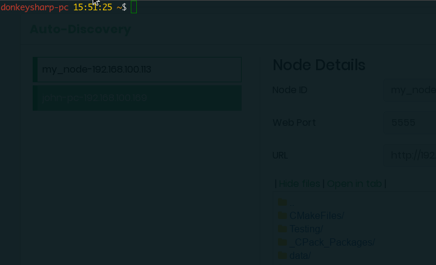

Gocho - Local Network File Sharing
==================================

Gocho let's you share a chosen directory with others on the same local network without the need to setup Samba or any other settings that are specific to a operating system. It provides a local dashboard that you can access from your browser to discover what others are sharing without the need to know other's IP addresses.

Run Gocho, browse to [localhost:1337](http://localhost:1337) and see what others are sharing!

<!-- Image of dashboard -->


## Install
[Download the latest release](https://github.com/donkeysharp/gocho/releases) for your operating system. Currently the next operating systems are supported:

* GNU/Linux 32 bits
* GNU/Linux 64 bits
* OSX
* Windows 32 bits
* Windows 64 bits

Download, unzip the file and add it to your path or a directory that is already in your system's path.

**Example unix-like**

    $ unzip gocho_0.1.0_darwin.zip
    $ mv gocho /usr/bin
    $ gocho --help

## Instructions
Currently Gocho needs to be executed from the command line in order to start sharing.

There are two ways to start sharing: specify the settings on a config file or specify the settings using command line flags.

### Specify a settings file
Gocho reads a settings file that is located at `$USER_HOME/.gocho.conf`. The format of the file is as follows:

```
NodeId: my-computer
WebPort: "5555"
LocalPort: "1337"
ShareDirectory: /home/user/some/directory
```

If you want Gocho to create this file for you, it's possible to run the configuration wizard by running:

    $ gocho configure

Which will ask for the different settings and create a `.gocho.conf` file.

Once settings file is created run the next to start sharing:

    $ gocho start


### Use command line flags
If you don't want to specify a configuration file or want to share a directory other than the specified on the `.gocho.conf` file, run:

    $ gocho start --dir /some/directory --id my-computer-tmp

This is the list of available flags

Flag | Description
--- | ---
--id {value} | Node ID that will be shared to other peers (**Required**)
--dir {value} | Directory to share (**Required**)
--share-port {value} |  Port that will be exposed for file sharing (default: "5555")
--local-port {value} | Port for local dashboard (default: "1337")

<!-- gocho using flags -->


## Contributing
If you want to help and contribute code don't forget to check the [Building document](docs/building.md) in order to have your environment ready for contributing.

## License
Licensed under the MIT License. See the [LICENSE](LICENSE) file for more details.
